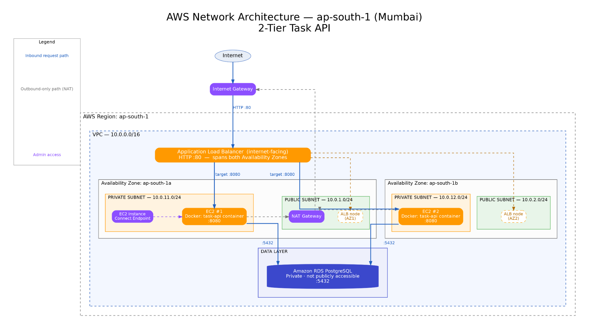
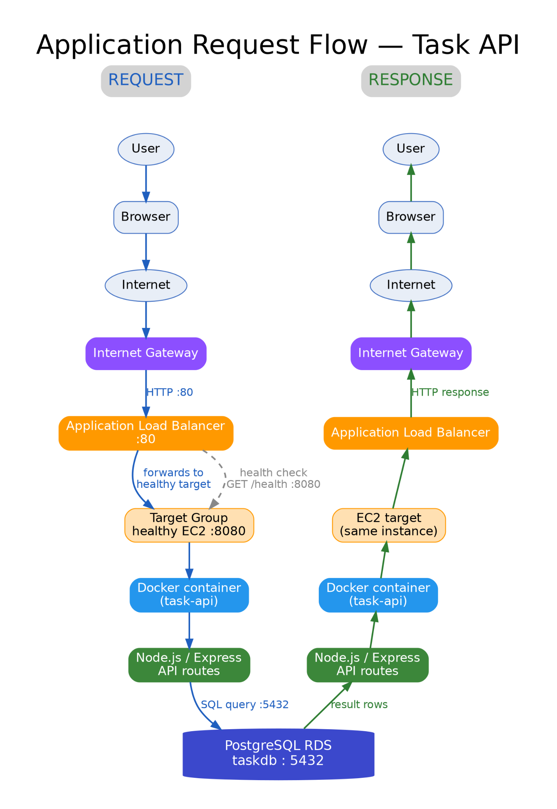
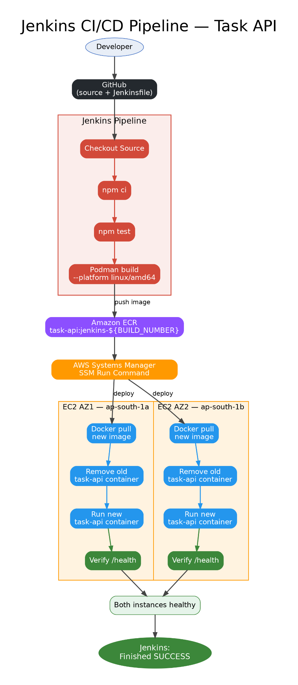

# AWS 2-Tier Task API

A containerized Node.js Task API deployed on AWS with a two-tier application design.

The project brings together:

- AWS VPC networking
- Internet-facing Application Load Balancer
- Two private EC2 application servers
- Amazon RDS PostgreSQL
- Amazon ECR
- Docker
- Podman
- Jenkins CI/CD
- GitHub
- AWS Systems Manager (SSM)
- Terraform
- Node.js / Express

The project has two important flows:

**Application flow**

> User → Internet → ALB → Private EC2 → Docker → Node.js / Express → PostgreSQL RDS

**Deployment flow**

> GitHub → Jenkins → Test → Podman → ECR → SSM → EC2 → Docker → Health Check

---

## Architecture

The project is documented using three separate diagrams. Each one answers a different question:

1. **Network Architecture** — Where is each AWS component placed?
2. **Application Request Flow** — What happens when a user sends a request?
3. **Jenkins CI/CD** — How does new application code reach both EC2 servers?

### 1. AWS Network Architecture



The AWS environment is deployed in **Asia Pacific (Mumbai), `ap-south-1`**.

The VPC is:

```text
10.0.0.0/16
```

It uses two Availability Zones with two public and two private subnets.

| Availability Zone | Public Subnet | Private Subnet |
|---|---|---|
| `ap-south-1a` | `10.0.1.0/24` | `10.0.11.0/24` |
| `ap-south-1b` | `10.0.2.0/24` | `10.0.12.0/24` |

The public layer contains the internet-facing ALB and the NAT Gateway is located in Public AZ1.

The private layer contains the two application EC2 instances.

The RDS PostgreSQL database is private and uses the private subnets.

The NAT Gateway is used for outbound connectivity from the private subnets. It is not part of the normal inbound user request path.

### 2. Application Request Flow



The application request path is:

```text
User
  ↓
Browser
  ↓
Internet
  ↓
Internet Gateway
  ↓
Application Load Balancer :80
  ↓
Target Group
  ↓
Healthy EC2 target :8080
  ↓
Docker container
  ↓
Node.js / Express API
  ↓
PostgreSQL RDS :5432
```

The response returns through the application path back to the user's browser.

The ALB target group contains the two private EC2 application servers and uses:

```text
Protocol: HTTP
Port: 8080
Health check path: /health
```

### 3. Jenkins CI/CD Architecture



The deployment pipeline is:

```text
Developer
   ↓
GitHub
   ↓
Jenkins
   ↓
Checkout Source
   ↓
npm ci
   ↓
npm test
   ↓
Podman build --platform linux/amd64
   ↓
Amazon ECR
   ↓
AWS Systems Manager
   ↓
EC2 AZ1 + EC2 AZ2
   ↓
Docker pull
   ↓
Remove old task-api container
   ↓
Run new task-api container
   ↓
Verify /health
   ↓
Both instances healthy
   ↓
Jenkins SUCCESS
```

---

## AWS Infrastructure

### VPC

```text
VPC CIDR: 10.0.0.0/16
Region: ap-south-1
```

### Public Subnets

```text
ap-south-1a → 10.0.1.0/24
ap-south-1b → 10.0.2.0/24
```

The internet-facing Application Load Balancer is placed across the two public subnets.

A single NAT Gateway is placed in the first public subnet.

### Private Subnets

```text
ap-south-1a → 10.0.11.0/24
ap-south-1b → 10.0.12.0/24
```

The application servers run in these private subnets.

The RDS subnet group also uses the two private subnets.

### Internet Gateway

The Internet Gateway provides connectivity between the VPC and the internet for the public networking layer.

### NAT Gateway

The NAT Gateway is located in Public AZ1.

Private instances use it for outbound internet access.

The inbound application path does not use the NAT Gateway.

---

## Application Load Balancer

The ALB is internet-facing and listens on:

```text
HTTP :80
```

It forwards application requests to the target group on:

```text
HTTP :8080
```

The target group uses:

```text
Health check path: /health
Health check port: 8080
```

The two EC2 instances are registered as application targets.

---

## Application Servers

There are two application servers:

```text
EC2 #1
Availability Zone: ap-south-1a
Subnet: 10.0.11.0/24

EC2 #2
Availability Zone: ap-south-1b
Subnet: 10.0.12.0/24
```

Both instances run the `task-api` Docker container.

The application container listens on:

```text
8080
```

The EC2 instances do not act as the public entry point. User traffic reaches them through the ALB.

---

## Database

The application uses Amazon RDS for PostgreSQL.

```text
Engine: PostgreSQL
Version: 16.13
Database: taskdb
Port: 5432
Instance class: db.t3.micro
Storage: 20 GB gp3
Publicly accessible: No
Multi-AZ: No
```

The database is in the private data layer.

The application security group is allowed to connect to PostgreSQL on port `5432`.

The Node.js application receives its database connection information through:

```text
DB_USER
DB_HOST
DB_NAME
DB_PASSWORD
DB_PORT
```

The real `.env` file is not part of the public repository.

---

## Security Group Flow

The intended traffic relationships are:

| Source | Destination | Port | Purpose |
|---|---|---:|---|
| Internet | ALB | `80` | Public HTTP entry |
| ALB security group | Application security group | `8080` | Forward application traffic |
| Application security group | RDS security group | `5432` | PostgreSQL access |
| Instance Connect Endpoint | Application security group | `22` | Administrative access |

The EC2 application servers are private.

The RDS database is private and is not directly exposed to the internet.

---

## Application

The backend is built with:

- Node.js 20
- Express
- PostgreSQL
- `pg`
- dotenv
- Jest
- Supertest

The server listens on:

```text
8080
```

The application starts with:

```text
node src/server.js
```

### API Endpoints

| Method | Endpoint | Purpose |
|---|---|---|
| `GET` | `/health` | Application health check |
| `POST` | `/api/tasks` | Create a task |
| `GET` | `/api/tasks` | Get all tasks |
| `GET` | `/api/tasks/:id` | Get one task |
| `PUT` | `/api/tasks/:id` | Update a task |
| `DELETE` | `/api/tasks/:id` | Delete a task |

The task routes use PostgreSQL parameterized queries for the CRUD operations.

---

## Containerization

The application is packaged as a Docker-compatible container using:

```text
node:20-alpine
```

The container:

```text
WORKDIR /app
    ↓
Copy package files
    ↓
npm ci --omit=dev
    ↓
Copy application source
    ↓
Expose 8080
    ↓
node src/server.js
```

Jenkins uses Podman to build the image for:

```text
linux/amd64
```

---

## Amazon ECR

The container image is stored in:

```text
Amazon ECR
Repository: task-api
Region: ap-south-1
```

Jenkins tags images using the Jenkins build number:

```text
jenkins-9
jenkins-10
jenkins-11
...
```

Example:

```text
427025827458.dkr.ecr.ap-south-1.amazonaws.com/task-api:jenkins-11
```

This makes a deployment traceable to a specific Jenkins build.

---

## Jenkins CI/CD

Jenkins uses GitHub as the source repository.

### Pipeline stages

**Checkout**

Jenkins checks out the application source and `Jenkinsfile` from GitHub.

**Install Dependencies**

```text
npm ci
```

**Run Tests**

```text
npm test
```

The health test verifies the `/health` endpoint.

**Build Image**

```text
podman build --platform linux/amd64
```

**Push Image**

Jenkins authenticates to Amazon ECR and pushes the build-tagged image.

**Deploy to EC2**

Jenkins uses AWS Systems Manager Run Command to deploy to both private EC2 instances.

The deployment performs:

```text
ECR login
   ↓
docker pull new image
   ↓
docker rm -f task-api
   ↓
docker run new image
```

This replaces the previous `task-api` container with the new image.

**Verify Deployment**

Jenkins verifies both instances and checks:

- `task-api` is running
- the expected ECR image is in use
- port `8080` is published
- `/health` returns successfully

A successful deployment ends with:

```text
END-TO-END DEPLOYMENT SUCCESSFUL
```

and:

```text
Finished: SUCCESS
```

---

## AWS Systems Manager

SSM is the deployment channel between Jenkins and the private EC2 instances.

```text
Jenkins
   ↓
AWS CLI
   ↓
SSM Run Command
   ├── EC2 #1
   └── EC2 #2
```

This lets Jenkins deploy to the private instances without making the application servers publicly accessible.

---

## IAM

The EC2 instances use IAM roles instead of storing long-lived AWS credentials inside the application container.

The EC2 role supports the access required for:

- Amazon ECR image pull
- AWS Systems Manager management

Jenkins uses AWS permissions required for:

- ECR authentication and image push
- SSM Run Command
- SSM command status and verification

---

## Terraform

Terraform is used as the infrastructure-as-code definition for the AWS environment.

The Terraform configuration covers:

```text
VPC
├── Public Subnet AZ1
├── Public Subnet AZ2
├── Private Subnet AZ1
├── Private Subnet AZ2
├── Internet Gateway
├── NAT Gateway
├── Public Route Table
├── Private Route Tables
├── Application Load Balancer
│   └── Target Group
├── EC2 Instance AZ1
├── EC2 Instance AZ2
├── RDS PostgreSQL
├── Security Groups
├── IAM Role / Instance Profile
└── EC2 Instance Connect Endpoint
```

Keeping the Terraform configuration in Git makes the infrastructure definition available for future recreation without manually rebuilding every AWS component.

Local Terraform state files and private keys should remain outside the public repository.

---

## Repository Structure

```text
aws-2tier-app/
├── app/
│   ├── src/
│   │   ├── config/
│   │   │   └── database.js
│   │   ├── routes/
│   │   │   └── taskRoutes.js
│   │   ├── app.js
│   │   └── server.js
│   ├── tests/
│   │   └── health.test.js
│   ├── Dockerfile
│   ├── .dockerignore
│   ├── .env.example
│   ├── .gitignore
│   ├── package.json
│   └── package-lock.json
│
├── docs/
│   ├── architecture/
│   │   ├── aws-network-architecture.png
│   │   ├── application-request-flow.png
│   │   └── cicd-pipeline.png
│   └── screenshots/
│
├── jenkins/
│   └── Dockerfile
│
├── terraform/
│   ├── main.tf
│   ├── provider.tf
│   ├── variables.tf
│   ├── outputs.tf
│   └── .terraform.lock.hcl
│
├── Jenkinsfile
├── README.md
└── .gitignore
```

The following should not be committed:

```text
node_modules/
app@tmp/
.env
*.pem
*.key
terraform.tfstate
terraform.tfstate.backup
```

---

## Deployment Evidence

The final pipeline was verified end-to-end.

The successful flow was:

```text
GitHub checkout
        ↓
Dependencies installed
        ↓
Tests passed
        ↓
AMD64 image built
        ↓
Image pushed to ECR
        ↓
SSM deployment
        ↓
Both EC2 instances updated
        ↓
Containers running
        ↓
Health checks passed
        ↓
END-TO-END DEPLOYMENT SUCCESSFUL
```

The final Jenkins run also reported:

```text
Application health checks passed.
Finished: SUCCESS
```

### Recommended screenshots

Store a small set of final evidence screenshots under:

```text
docs/screenshots/
```

Recommended evidence:

- `jenkins-successful-deployment.png`
- `ecr-task-api-image.png`
- `ec2-containers-running.png`
- `application-health.png`

Together they demonstrate:

> **Build → Registry → Deployment → Running Application**

---

## Technologies Used

| Area | Technology |
|---|---|
| Cloud | AWS |
| Region | `ap-south-1` |
| Infrastructure as Code | Terraform |
| Networking | VPC |
| Load Balancing | Application Load Balancer |
| Compute | EC2 |
| Containers | Docker |
| Image Build | Podman |
| Registry | Amazon ECR |
| Database | Amazon RDS PostgreSQL |
| CI/CD | Jenkins |
| Source Control | GitHub |
| Deployment | AWS Systems Manager |
| Backend | Node.js / Express |
| Database Driver | `pg` |
| Testing | Jest / Supertest |

---

## Project Outcome

This project connects the complete application and deployment lifecycle:

### Application

**User → Internet → ALB → Private EC2 → Docker → Node.js / Express → PostgreSQL RDS**

### Deployment

**Developer → GitHub → Jenkins → Test → Podman → ECR → SSM → EC2 → Docker → Health Check**

The result is a working AWS application with infrastructure defined in Terraform and application deployment automated through Jenkins.
